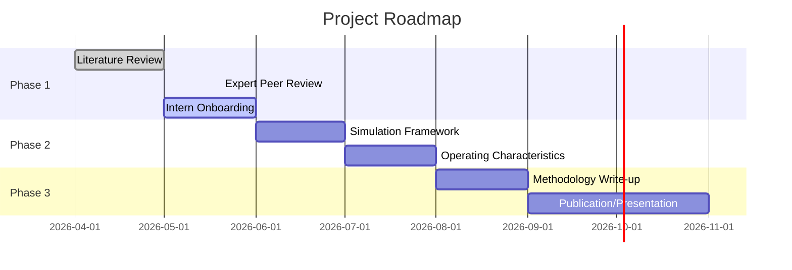

# Adaptive Phase II/III Pick-a-Winner Design

> **Literature review, intern brief, and simulation framework for adaptive seamless Phase II/III designs in oncology.**
>
> *Project at Merck — Statistical Methodology*

## Background

Traditional oncology drug development runs Phase II and III as **separate sequential trials** — time-consuming and inefficient, with Phase II patients excluded from the final analysis.

This project explores a **single seamless Phase II/III design** that:

1. **Starts** with multiple doses or arms
2. **Selects** the "winner" at an interim analysis based on a **short-term endpoint** (ORR, binary, weeks)
3. **Confirms** with a **long-term endpoint** (OS, time-to-event, months–years)

The core statistical challenge: different data types and imperfect correlation between ORR and OS mean the best ORR arm isn't guaranteed to be the best OS arm, and shared patient data between selection and testing creates bias that must be controlled.

## Contents

| File | Description |
|------|-------------|
| `pick-a-winner-lit-review.md` | Comprehensive literature review covering key methods — Stallard & Todd, Bauer & Posch, Dunnett, Magirr et al., Wu et al., Zhang & Jin, and more |
| `pick-a-winner-lit-review-v3.pdf` | Compiled PDF of the literature review |
| `pick-a-winner-intern-brief.md` | Intern-facing project brief with problem statement, key references, and guidance |
| `audit/` | Independent peer reviews by [Gemini 2.5 Pro](./audit/gemini-review-lit-v2.md) and [Claude Opus 4](./audit/claude-review-lit-v2.md) |

## Key Methods Covered

| Method | Key Reference | Role |
|--------|--------------|------|
| Pick-the-winner | Stallard & Todd (2003) | Two-stage, K treatments → select best at interim via efficient score |
| Bias from endpoint reuse | Bauer & Posch (2004) | Why shared patient data between ORR interim and OS final inflates type I error |
| Multiple comparison | Dunnett (1955) | K treatments vs control adjustment |
| Generalized Dunnett for MAMS | Magirr et al. (2012) | Multi-arm multi-stage boundary computation via conditional independence (normal endpoints) |
| SCPRT-based MAMS | Wu et al. (2023) | Analytical boundaries for multi-stage selection |
| ORR/PFS→OS seamless | Zhang & Jin (2025) | Multi-stage group sequential Phase 2/3 with short-term selection, long-term confirmation |
| Correlation formulas | Zhong et al. (2025) | Analytic ρ(ORR, OS) for design calibration |
| Cohort separation | Jenkins et al. (2011) | Clean framework for unbiased final testing after interim selection |

## Project Phases

## Peer Review Summary

Both **Gemini 2.5 Pro** and **Claude Opus 4** reviewed the literature review independently. Key findings:

| Area | Verdict |
|------|---------|
| Gemini | **Major Revision** — missing MAMS TTE references (Magirr 2012, Bauer & Posch 2004), structural fragmentation from v1→v2 merge |
| Claude | **Minor Revision** — add Bayesian methods section, estimand alignment discussion, fix multi-state model spec |
| Consensus | Strong foundation; both recommend starting simulation with Stallard & Todd (2003) rather than Zhang & Jin (2025) |

Full reviews:
- 📄 [Claude Opus 4 Review](./audit/claude-review-lit-v2.md)
- 📄 [Gemini 2.5 Pro Review](./audit/gemini-review-lit-v2.md)

## For the Intern

If you're the intern working on this project, start here:

1. **Read the [intern brief](./pick-a-winner-intern-brief.md) first** — it frames the problem and your task
2. **Read the [literature review](./pick-a-winner-lit-review.md)** for the full picture
3. **Read the peer reviews** in `audit/` — they contain practical simulation advice and critical caveats
4. **Prioritized reading order** (per Claude):
   1. Stallard & Todd (2003) — pick-a-winner foundation
   2. Jenkins et al. (2011) — bias solution framework
   3. Sun et al. (2020) — most directly applicable setting
   4. Zhang & Jin (2025) — closest concrete design
   5. Zhong et al. (2025) — ρ(ORR, OS) formulas

### Simulation Tips from the Reviews

- **Start with binary→binary** (ORR at interim, ORR at final) before adding TTE complexity
- **Validate null first** — confirm exact 0.025 type I error before running alternatives
- **Don't attempt Zhang & Jin reproduction in 2 weeks** — allocate 3-4 weeks minimum
- **Use `rpact` or `gsDesign`**, not custom multivariate normal integration
- **Save full state** (RNG seed, parameters, full results) on every run — you'll need it for debugging
- **Expect 3-4 slow weeks** at the start — bugs in correlation structure, selection rules, and combination tests take time to track down
- **Calibrate ρ(ORR, OS) from published meta-analyses**, not raw historical data (Prasad et al. 2015 is a good starting point)

## Status

✅ Literature review complete
✅ Expert peer reviews complete (Gemini + Claude)
⬜ Intern onboarding in progress
⬜ Simulation framework — upcoming

## Related Repos

- [Small Strata Pooling](https://github.com/doublerobust/small-strata-pooling) — How to handle sparse stratification with standard analysis methods
- [Ridge-Cal](https://github.com/doublerobust/ridge-cal) — Regularized calibration of external prognostic scores using blinded trial data

---

*Merck & Co., Inc., Rahway, NJ, USA*
