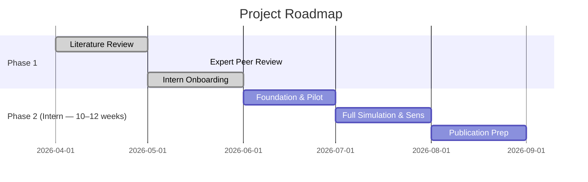

# Adaptive Phase II/III Pick-a-Winner Design

> **Literature review, intern brief, and simulation framework for adaptive seamless Phase II/III designs in oncology.**
>
> *Project at Merck — Statistical Methodology*

## Background

Traditional oncology drug development runs Phase II and III as **separate sequential trials** — time-consuming and inefficient, with Phase II patients excluded from the final analysis.

This project explores a **single seamless Phase II/III design** that:

1. **Starts** with multiple doses or arms
2. **Selects** the "winner" at an interim analysis based on a **short-term endpoint** (ORR, binary, weeks)
3. **Confirms** with a **long-term endpoint** (OS, time-to-event, months–years)

The core statistical challenge: different data types and imperfect correlation between ORR and OS mean the best ORR arm isn't guaranteed to be the best OS arm, and shared patient data between selection and testing creates bias that must be controlled.

## Contents

| File | Description |
|------|-------------|
| `pick-a-winner-lit-review.md` | Comprehensive literature review — Stallard & Todd, Bauer & Posch, Dunnett, Magirr et al., Wu et al., Wang et al. (rank-based), Zhang & Jin, Zhong et al. (DTL), Hua et al. (closed testing + GS), Sun et al. (2-in-1), Jenkins et al. (cohort-separation), Broglio et al. (survey) |
| `pick-a-winner-lit-review-v3.pdf` | Compiled PDF of the literature review |
| `pick-a-winner-intern-brief.md` | Intern-facing project brief with 10–12 week implementation plan |
| `audit/` | Independent peer reviews by [Gemini 2.5 Pro](./audit/gemini-review-lit-v2.md) and [Claude Opus 4](./audit/claude-review-lit-v2.md) |

## Key Methods Covered

| Method | Key Reference | Role |
|--------|--------------|------|
| Pick-the-winner | Stallard & Todd (2003) | Two-stage, K treatments → select best at interim via efficient score |
| Bias from endpoint reuse | Bauer & Posch (2004) | Why shared patient data between ORR interim and OS final inflates type I error |
| Multiple comparison | Dunnett (1955) | K treatments vs control adjustment |
| Generalized Dunnett for MAMS | Magirr et al. (2012) | Multi-arm multi-stage boundary computation via conditional independence (normal endpoints) |
| SCPRT-based MAMS | Wu et al. (2023) | Analytical boundaries for multi-stage selection |
| Rank-based Dunnett | Wang et al. (2023) | Shortcut adjustment using biomarker rank; more powerful than Šidák when r < m |
| Cohort separation + INCT | Zhang & Jin (2025) | Multi-stage group sequential Phase 2/3 with short-term selection, long-term confirmation |
| ρ(ORR, OS) formulas | Zhong et al. (2025) | Analytic correlation derivation under PH + DTL design with software |
| Closed testing + group-sequential | Hua, Wang & Luo (2026) | 8-hypothesis framework with independent increment argument |
| Cohort separation | Jenkins et al. (2011) | Clean framework for unbiased final testing after interim selection |
| 2-in-1 benefit-cost | Sun et al. (2020) | Benefit-cost ratio criteria for when seamless is worth the complexity |
| Seamless survey | Broglio et al. (2024) | Systematic review of adaptive seamless designs in late-phase oncology |

## Project Phases

The full implementation spans **10–12 weeks** (intern, Summer 2026):

| Phase | Weeks | Focus | Deliverable |
|-------|-------|-------|-------------|
| **Foundation** | 1–2 | Read Stallard & Todd (2003), Bauer & Posch (2004), Jenkins et al. (2011). Implement two-arm two-stage design in R from scratch. Validate against published tables. | Working Stallard & Todd reproduction |
| **Pilot** | 3–4 | Read Sun et al. (2020), Zhang & Jin (2025), Zhong et al. (2025), Wang et al. (2023), Hua et al. (2026). Binary→binary simulation (ORR both stages). Small pilot grid (2–3 scenarios × 1k reps). Add multi-state DGP with Weibull transitions. | Working binary→binary sim + pilot results |
| **Full Simulation** | 5–7 | Full ORR→OS with multi-state DGP + copula correlation. Null, alternatives A–D, sensitivity. Safety-driven selection, non-PH (delayed separation). Compare cohort-separation vs independent-increment. 5k–10k reps/scenario. | Full simulation grid with MC errors |
| **Sensitivity** | 8–9 | ρ calibration from Prasad et al. (2015). Compare pick-a-winner vs drop-the-losers vs traditional sequential. Compare carry-one vs carry-two. Build R package structure. | Sensitivity results + R package |
| **Publication** | 10–12 | Methodology draft, figures (power curves, PCS curves, FWER contours). Reproducible vignette. Presentation prep. | R package + vignette + methodology note + 15-min talk |

## Peer Review Summary

Both **Gemini 2.5 Pro** and **Claude Opus 4** reviewed the literature review independently. Key findings:

| Area | Verdict |
|------|---------|
| Gemini | **Major Revision** — missing MAMS TTE references (Magirr 2012, Bauer & Posch 2004), structural fragmentation from v1→v2 merge |
| Claude | **Minor Revision** — add Bayesian methods section, estimand alignment discussion, fix multi-state model spec |
| Consensus | Strong foundation; both recommend starting simulation with Stallard & Todd (2003) rather than Zhang & Jin (2025) |

Full reviews:
- 📄 [Claude Opus 4 Review](./audit/claude-review-lit-v2.md)
- 📄 [Gemini 2.5 Pro Review](./audit/gemini-review-lit-v2.md)

## For the Intern

This is a **10–12 week project**. See the [intern brief](./pick-a-winner-intern-brief.md) for the full timeline.

1. **Read the [intern brief](./pick-a-winner-intern-brief.md) first** — it frames the problem and your task
2. **Read the [literature review](./pick-a-winner-lit-review.md)** for the full picture
3. **Read the peer reviews** in `audit/` — they contain practical simulation advice and critical caveats
4. **Prioritized reading order** (per Claude):
   1. Stallard & Todd (2003) — pick-a-winner foundation
   2. Jenkins et al. (2011) — bias solution framework
   3. Sun et al. (2020) — most directly applicable setting
   4. Zhang & Jin (2025) — closest concrete design
   5. Zhong et al. (2025) — ρ(ORR, OS) formulas

### Key Simulation Tips

- **Start with Stallard & Todd reproduction** (Week 1–2) before attempting Zhang & Jin
- **Binary→binary first** (ORR both stages) before adding TTE complexity
- **Pilot phase after binary→binary** — run 2–3 scenarios × 1k reps to catch bugs and bottlenecks
- **Validate null first** — confirm exact 0.025 type I error before running alternatives
- **Use `rpact` or `gsDesign`**, not custom multivariate normal integration
- **Build the R package from day one** — `R/`, `inst/sims/`, `vignettes/`
- **Save full state** (RNG seed, parameters, full results) on every run — debugging at week 9 will thank you
- **Expect 3–4 slow weeks** at the start — bugs in correlation structure, selection rules, and combination tests take time to track down
- **Calibrate ρ(ORR, OS) from published meta-analyses** (Prasad et al. 2015), not raw historical data
- **Include sensitivity for non-PH** (delayed separation typical in immuno-oncology) and safety-driven selection

## Status

✅ Literature review complete
✅ Expert peer reviews complete (Gemini + Claude)
✅ Intern onboarding complete
✅ Intern brief aligned with 10–12 week plan
⬜ Simulation framework — Phase 2 (intern, Summer 2026)

## Related Repos

- [Small Strata Pooling](https://github.com/doublerobust/small-strata-pooling) — How to handle sparse stratification with standard analysis methods
- [Ridge-Cal](https://github.com/doublerobust/ridge-cal) — Regularized calibration of external prognostic scores using blinded trial data

---

*Merck & Co., Inc., Rahway, NJ, USA*
